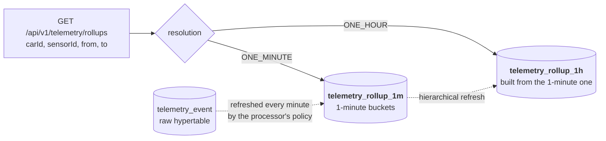
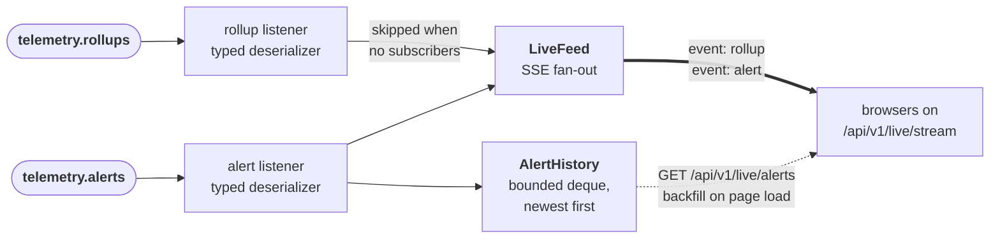

# pitwall-serving

The pit wall itself. Pushes live rollups and alerts to the browser over SSE, serves historical queries
from the TimescaleDB continuous aggregates, and hosts the dashboard.

## Run

Everything else first (`docker compose up -d`, then the processor), because this service consumes the
topics the processor produces.

```bash
./mvnw -pl pitwall-serving -am spring-boot:run
```

Then open **http://localhost:8083**.

## The dashboard

One static page, no build step, no npm in a Java repo. Three things on it:

- **Live**: the latest 1-second rollup for every `(car, sensor)` channel, straight off the SSE feed.
  A car whose channel has breached a threshold gets a highlighted border.
- **Alerts**: threshold breaches as they fire, newest first, backfilled on load from
  `/api/v1/live/alerts` so a browser opening late still sees recent history.
- **History**: pick a car, a sensor, and a resolution, and query the continuous aggregates. The page
  reports how long the query took, which is the point: it is reading pre-computed buckets, not raw
  rows.

## API

| Method | Path | Purpose |
|---|---|---|
| `GET` | `/api/v1/live/stream` | SSE feed, events named `rollup` and `alert` |
| `GET` | `/api/v1/live/alerts` | Recent alerts, newest first |
| `GET` | `/api/v1/telemetry/cars` | Car ids present in the aggregates |
| `GET` | `/api/v1/telemetry/sensors` | Sensor ids present in the aggregates |
| `GET` | `/api/v1/telemetry/rollups` | `carId`, `sensorId`, `resolution=ONE_MINUTE\|ONE_HOUR`, `from`, `to` |

```bash
curl -N localhost:8083/api/v1/live/stream
curl "localhost:8083/api/v1/telemetry/rollups?carId=CAR-01&sensorId=speed&resolution=ONE_MINUTE"
```

### The read path never touches the raw table

`resolution` selects which continuous aggregate answers the query. The raw hypertable feeds the
aggregates on write and is never read by this service.



## Why SSE and not WebSocket

The feed is one-way: server to browser, no client-to-server messages. SSE is plain HTTP, reconnects
on its own, and needs no protocol upgrade or extra infrastructure. A WebSocket would buy a return
channel this feed has no use for.

It also happens to mirror the real thing: FIA rules have made F1 telemetry one-way since 2003.

## Two consumer groups, two typed deserializers

`telemetry.rollups` and `telemetry.alerts` carry different record types, so a single global
`spring.json.value.default.type` cannot serve both. `KafkaConsumerConfiguration` builds one listener
container factory per type, each with its own `JacksonJsonDeserializer` and type headers off, and the
listeners select between them with `containerFactory`.

The rollup listener returns early when nobody is subscribed; with no dashboard open there is no
reason to fan anything out.



## Metrics

Exported over OTLP to `grafana/otel-lgtm` every 5s, and readable locally on
`/actuator/metrics`. There is no `/actuator/prometheus`, because this platform does not carry a
Prometheus registry, and nothing scrapes it. Names below are the Micrometer names; see
[`observability/README.md`](../observability/README.md) for how OTLP renames them in Grafana.

| Metric | Meaning |
|---|---|
| `pitwall.serving.subscribers` | Browsers attached to the live feed |
| `pitwall.serving.events.delivered` | Server-sent events pushed |
| `pitwall.serving.subscribers.dropped` | Subscribers removed after a failed push |
